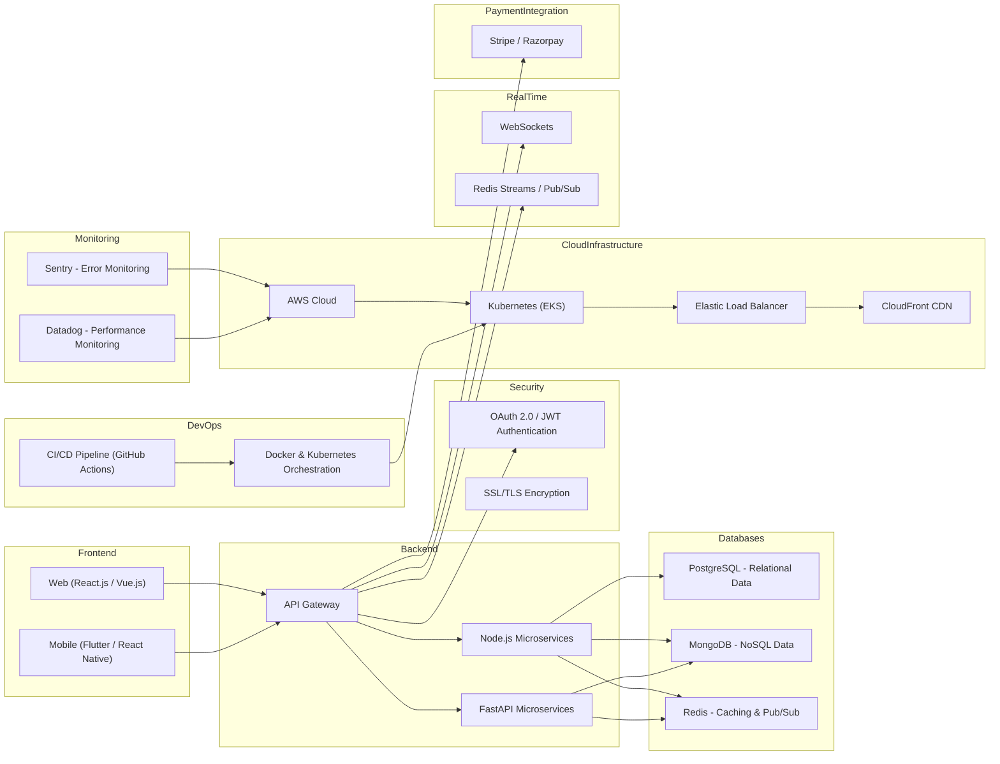

```mermaid
flowchart LR
    subgraph Frontend
        A1["Web (React.js / Vue.js)"]
        A2["Mobile (Flutter / React Native)"]
    end

    subgraph Backend
        B1["API Gateway"]
        B2["Node.js Microservices"]
        B3["FastAPI Microservices"]
    end

    subgraph Databases
        D1["PostgreSQL - Relational Data"]
        D2["MongoDB - NoSQL Data"]
        D3["Redis - Caching & Pub/Sub"]
    end

    subgraph Security
        S1["OAuth 2.0 / JWT Authentication"]
        S2["SSL/TLS Encryption"]
    end

    subgraph CloudInfrastructure
        C1["AWS Cloud"]
        C2["Kubernetes (EKS)"]
        C3["Elastic Load Balancer"]
        C4["CloudFront CDN"]
    end

    subgraph DevOps
        CI["CI/CD Pipeline (GitHub Actions)"]
        DPL["Docker & Kubernetes Orchestration"]
    end

    subgraph Monitoring
        M1["Sentry - Error Monitoring"]
        M2["Datadog - Performance Monitoring"]
    end

    subgraph RealTime
        R1["WebSockets"]
        R2["Redis Streams / Pub/Sub"]
    end

    subgraph PaymentIntegration
        P1["Stripe / Razorpay"]
    end

    A1 --> B1
    A2 --> B1
    B1 --> B2
    B1 --> B3
    B2 --> D1
    B2 --> D2
    B3 --> D2
    B2 --> D3
    B3 --> D3
    B1 --> S1
    B1 --> R1
    B1 --> R2
    B1 --> P1
    C1 --> C2
    C2 --> C3
    C3 --> C4
    CI --> DPL
    DPL --> C2
    M1 --> C1
    M2 --> C1

```